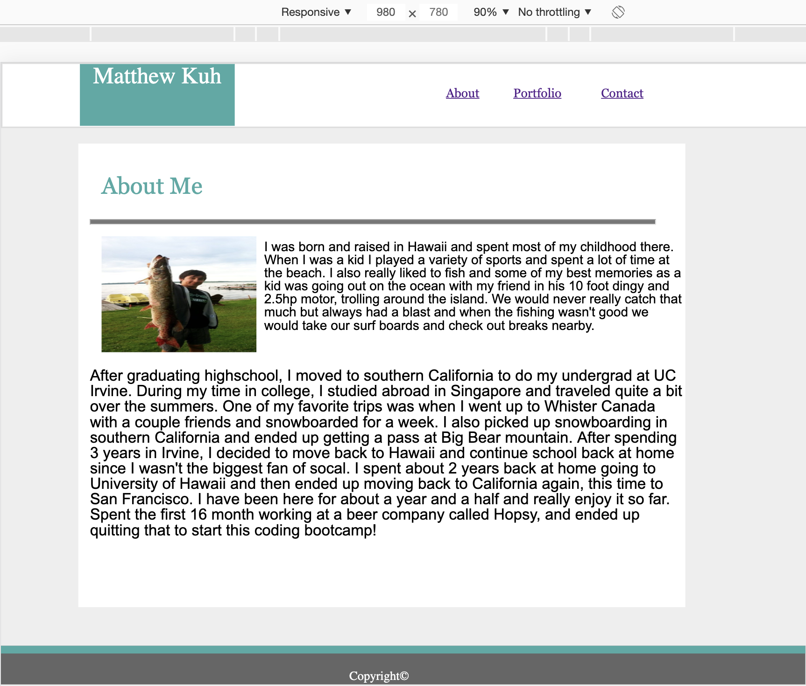
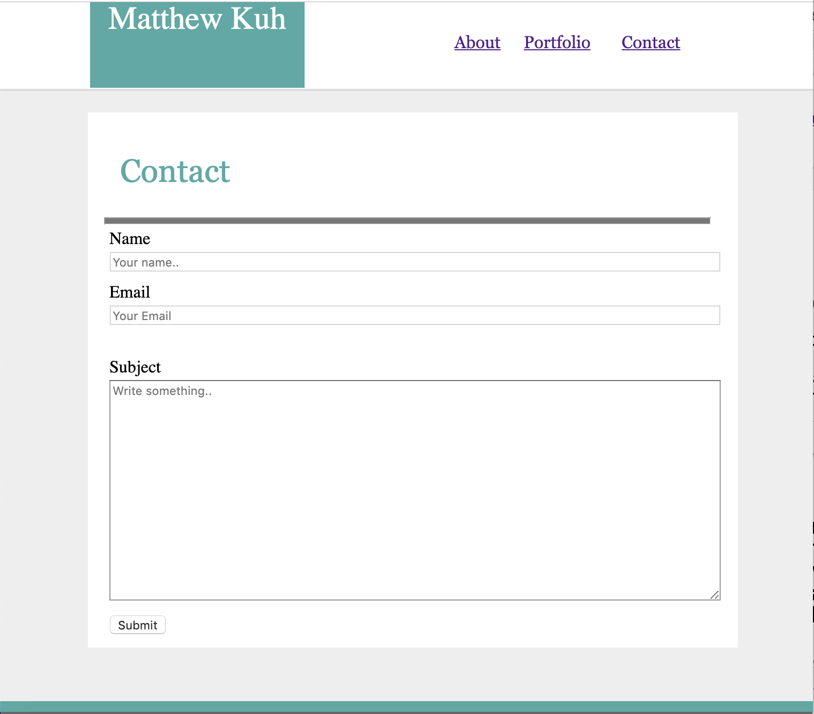
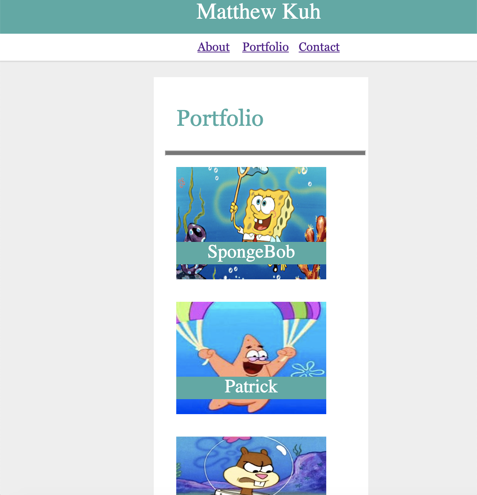

### I used media screen tags with max widths 960px, 768px, and 640px to make my portfolio website responsive to these various screen widths.

## Tech I Used

1. [HTML](https://www.w3schools.com/html/html_intro.asp)
2. [CSS](https://www.w3schools.com/html/html_css.asp)

Author : [Matthew Kuh](https://github.com/matkuh)

